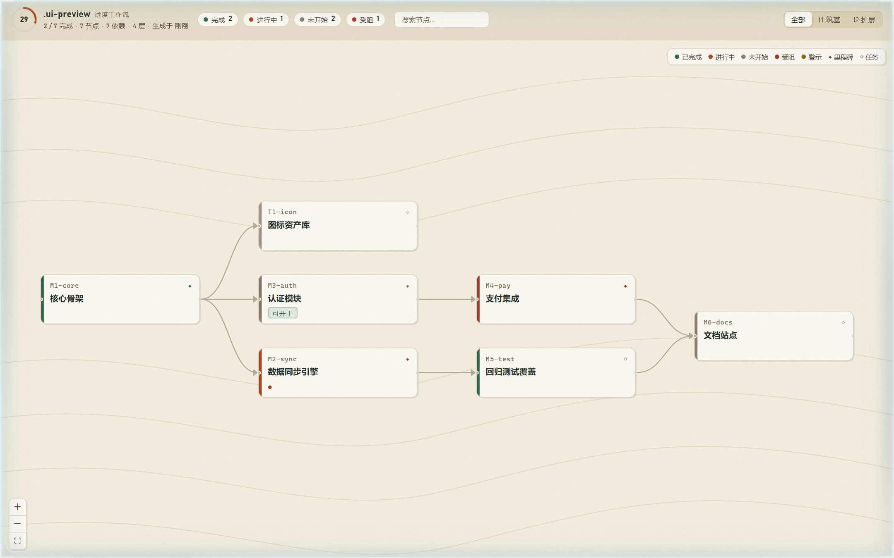

<p align="center">
  English | <a href="README.md">简体中文</a>
</p>

<h1 align="center">waymark</h1>

<p align="center">
  A <code>/plan</code>-driven project progress CLI — plan documents + code evidence → inferred completion → an interactive DAG workflow page
</p>

<p align="center">
  <a href="https://github.com/cyber-teahouse/waymark/actions/workflows/ci.yml"></a>
  <a href="#"></a>
  <a href="#"></a>
  <a href="LICENSE"></a>
  <a href="https://github.com/cyber-teahouse/waymark/commits/main"></a>
  <a href="https://github.com/cyber-teahouse/waymark"></a>
</p>

> This document is a translation. The [Chinese README](README.md) is the authoritative original.

In the backcountry, a **waymark** tells you where you are and where to head next. This project does the same for software projects: it treats the plan documents under `plan/` as trail markers, scans your code for evidence to infer each marker's real progress, and lays it all out as an interactive DAG trail map — so neither humans nor AI agents get lost in the mountains.

## ✨ Highlights

| | |
|---|---|
| 📄 **Documents as the data source** | One node, one Markdown file (frontmatter declares status/deps/acceptance/evidence). No database, no account. |
| 🔍 **Four-dimensional evidence** | `paths` / `grep` / `tests` / `git` evidence is scored to infer node completion automatically. |
| ⚖️ **Conflicts warn, never overwrite** | Inference never overrides declarations: thin evidence ⚠, ready to complete 💡, stalled 🛑 — highlighted, but your plan stays yours. |
| 🤖 **Closed loop for AI agents** | `start` to claim, `ready` to list actionable nodes, `done` to wrap up (with guardrail warnings), `block`/`drop` for side-tracks, `reopen` to undo — plus an MCP toolset for fully in-protocol operation. |
| 📦 **Single-file page** | The web build is embedded in the CLI: `.waymark/index.html` opens with a double-click, zero dependencies in the target project. |
| 🔥 **Live reload** | `waymark ui` watches plan/, evidence dirs and git; changes are pushed via SSE within seconds with partial page refresh (canvas viewport preserved, no full reload). Claim/complete nodes right from the page. |

## 🥾 Quick Start

```bash
npm i -g waymark-cli   # requires Node >= 20

cd /path/to/your-project
waymark init       # generate the plan/ skeleton
waymark check      # validate conventions (CI-friendly, exit 1 on errors)
waymark sync       # parse plan + code evidence → .waymark/workflow.json
waymark status     # terminal progress overview (progress bar / ready / blocked)
waymark render     # generate self-contained .waymark/index.html
waymark ui         # local live page (default http://localhost:7300)
```

Advancing nodes (AI-agent friendly):

```bash
waymark start M-xxx                         # claim a node (planned → in-progress)
waymark acc M-xxx 2 3                       # toggle acceptance items (1-based, multiple allowed)
waymark done M-xxx -m "what was done" [--acc]  # mark done + append a completion record
waymark ready                               # list nodes ready to start
waymark block M-xxx -m "waiting on a decision"  # mark blocked (side-track state)
waymark drop M-xxx                          # drop a node (side-track state)
waymark reopen M-xxx                        # undo: done/blocked/dropped → in-progress (--planned for planned)
```

`waymark render` produces a self-contained progress page (single file, double-click to open):



Keyboard support: `j`/`k` (or `↑`/`↓`) to move along the trail, `Enter` to jump between search matches, `/` to focus search, `Esc` to close details.

## 🗺️ Commands

| Command | What it does |
|---|---|
| `waymark init` | Generate a `plan/` skeleton in the project root (overview + iteration + sample node) |
| `waymark check` | Validate plan conventions: unique ids / deps exist / no cycles / iteration refs / overview consistency / regex validity |
| `waymark sync` | Parse plan + evidence inference → `.waymark/workflow.json` (with warnings) |
| `waymark status [--fresh]` | Terminal overview: ASCII progress bar, status stats, ready/blocked lists; `--fresh` auto-syncs when data is missing or stale |
| `waymark render [--fresh]` | Generate self-contained `.waymark/index.html` from workflow.json; `--fresh` auto-syncs first when data is missing/stale |
| `waymark ui [-p 7300]` | Local live workflow page; watches plan/, evidence dirs and git, pushes updates via SSE; claim/start/done/block/drop/reopen from the page (same engine as CLI/MCP, guardrail warnings included) |
| `waymark start <id>` | Claim a node: planned → in-progress (warns when deps are unmet, never blocks) |
| `waymark done <id> -m <note>` | Mark done, append a dated completion record; optional `--acc` checks all acceptance items; guardrail warnings for unmet deps / unchecked acceptance / odd prior status |
| `waymark acc <id> <n…>` | Toggle acceptance items (1-based, matching page order, multiple allowed) |
| `waymark block <id> -m <reason>` | Mark blocked (side-track); the note lands in the completion record with a `[blocked]` prefix; unblock via `reopen` |
| `waymark drop <id> -m <reason>` | Drop a node (side-track); `[dropped]` prefix |
| `waymark reopen <id> [--planned]` | Reopen done/blocked/dropped nodes: in-progress by default, `--planned` back to planned; `[reopened]` prefix |
| `waymark ready` | List planned nodes whose deps are satisfied (marked purple as "ready" on the page) |
| `waymark hub [patterns…] [-o file]` | Multi-project overview: aggregate each project's workflow.json into one static page (default `.waymark/hub.html`), with hints for unsynced projects |
| `waymark mcp` | Start as an MCP stdio server exposing the above to AI agents |

Global option: `--root <dir>` sets the project root (defaults to the current directory) and works on every subcommand — **before or after the subcommand** (`waymark --root X check` equals `waymark check --root X`; the latter wins).

## 🏔️ Multi-project hub

Run `waymark hub` in the parent directory of your waymark projects to aggregate all of them into a single static overview page (default `.waymark/hub.html`): one card per project (completion ring, status distribution, data freshness), each linking to its progress page; unsynced projects get a `waymark sync` hint.

```bash
cd /path/to/projects               # each subdirectory is a project
waymark hub                        # scan first-level dirs → .waymark/hub.html
waymark hub "work/*" -o out.html   # or pass directory globs and a custom output path
```


## 🪧 The /plan structure

```
plan/
├── overview.md          # framework doc entry + milestone overview table
├── milestones/*.md      # one node per file
│   # frontmatter: id / title / type / status / deps / iteration / evidence / acceptance
└── iterations/*.md      # iteration plans (id / title / goal / window)
```

- **State machine**: `planned → in-progress → done` (side-tracks `blocked` / `dropped`, set by `block` / `drop`, restored by `reopen`)
- **Four evidence dimensions**: `paths` (files exist) / `grep` (code hits) / `tests` (tests exist) / `git` (commit matches); inference only warns, never overwrites declarations
- **Iterations evolve**: add `plan/iterations/I2-xxx.md` + tag nodes with `iteration: I2` → appears in `ui` within seconds

### check rules

| Level | Rules |
|---|---|
| error (exit 1) | duplicate ids / deps pointing to missing nodes / dependency cycles (with paths) / invalid iteration refs / overview table and milestones disagree / invalid evidence regexes |
| warning (hint only) | done without a completion record / done with unchecked acceptance / in-progress with no acceptance checked / empty evidence declarations / overview title mismatch |

## 🤖 MCP integration

`waymark mcp` starts an MCP stdio server, no extra arguments. Add to your client config:

```json
{ "mcpServers": { "waymark": { "command": "waymark", "args": ["mcp"] } } }
```

| Tool | Description |
|---|---|
| `waymark_summary` | Workflow overview (lightweight JSON: stats/iterations/node statuses) |
| `waymark_get_node` | Node details by id (acceptance/evidence/commits/completion log) |
| `waymark_list_ready` | List nodes ready to start |
| `waymark_start_node` | Claim a node (planned → in-progress; returns guardrail warnings and the next ready nodes) |
| `waymark_mark_done` | Mark done and append a completion record (returns guardrail warnings and the next ready nodes) |
| `waymark_toggle_acceptance` | Toggle acceptance items (indices are 1-based, multiple allowed; returns the updated list) |
| `waymark_block_node` | Mark blocked (side-track, optional note) |
| `waymark_drop_node` | Drop a node (side-track, optional note) |
| `waymark_reopen_node` | Reopen done/blocked/dropped nodes (in-progress by default, `planned=true` back to planned) |
| `waymark_check` | Validate plan conventions, returning errors/warnings in detail |

Results are cached by an mtime fingerprint of the inputs (plan/ + evidence dirs + git index), so high-frequency calls don't rescan.

## 🔄 CI auto-render

See [docs/ci-example.yml](docs/ci-example.yml): on push, automatically `sync + render` and commit `.waymark/index.html` (git evidence needs `fetch-depth: 0`). waymark's own test pipeline lives in [.github/workflows/ci.yml](.github/workflows/ci.yml) (ubuntu/windows × node 20/22 matrix).

## 🧰 Project structure

```
src/
├── cli.ts          # entry: init / check / sync / status / start / done / block / drop / reopen / ready / render / ui / mcp / hub
├── parser/         # plan/ document parsing (frontmatter + completion log + overview table)
├── graph/          # DAG construction (topo sort / cycle detection) and check rules
├── infer/          # four-dimensional evidence scoring → status inference
├── sync/           # declared×inferred conflict matrix → workflow.json + mtime fingerprint cache (shared by MCP/UI)
├── render/         # contract self-check + data injected into a single-file HTML (with evidence staleness detection)
├── plan/           # start / done / block / drop / reopen / ready commands + shared check validation
├── ui/             # local server: chokidar watch + SSE push of workflow data (partial refresh)
├── mcp/            # MCP stdio server
├── hub/            # multi-project aggregate overview page
└── version.ts      # single source of the version number (package.json at the package root)
web/                # React SPA (xyflow DAG canvas + dagre layout)
tests/              # 21 test files (parser/graph/infer/render/server/e2e/mcp/hub)
```

## 🛠️ Contributing

```bash
git clone https://github.com/cyber-teahouse/waymark.git
cd waymark
npm install
npm run build && npm run build:web   # build the CLI and the page bundle
npm link            # register the waymark command globally
npm test            # biome + typecheck + vitest
```

## 🧭 Known issues

- SVG animations on the page may freeze into static frames on GitHub — the banner is designed static-first
- Staleness detection is file-mtime based (plan/ + evidence dirs + git index), accurate to filesystem clock granularity
- Running `waymark ui` with a Windows 8.3 short path (e.g. `ADMINI~1`) as the project root may crash chokidar/libuv assertions — use the regular long path (watch targets are realpath-normalized; regular paths are unaffected)

## 📜 License

[MIT](LICENSE) · If waymark saved you one progress-alignment meeting, a ⭐ is appreciated.
