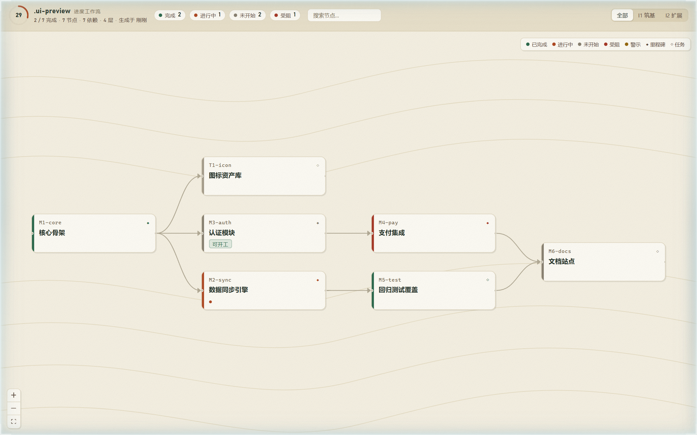
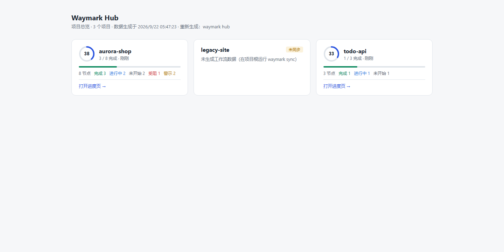

<p align="center">
  
</p>

<h1 align="center">waymark</h1>

<p align="center">
  <code>/plan</code> 驱动的项目进度工作流可视化 CLI —— 计划文档 + 代码证据 → 自动推断完成度 → DAG 工作流页面
</p>

<p align="center">
  <a href="https://github.com/cyber-teahouse/waymark/actions/workflows/ci.yml"></a>
  <a href="#"></a>
  <a href="#"></a>
  <a href="LICENSE"></a>
  <a href="https://github.com/cyber-teahouse/waymark/commits/main"></a>
  <a href="https://github.com/cyber-teahouse/waymark"></a>
</p>

在山野里，**waymark（路标）**告诉你走到了哪、下一步往哪去。这个项目为软件项目做同样的事：把 `plan/` 目录下的计划文档当作路标石，扫描代码证据自动推断每块路标的真实进度，再铺成一张可交互的 DAG 步道地图——人和 AI agent 都不会在山里迷路。

## ✨ 亮点

| | |
|---|---|
| 📄 **文档即数据源** | 一个节点一个 Markdown 文件（frontmatter 声明状态/依赖/验收/证据），无数据库、无账号 |
| 🔍 **证据四维推断** | `paths` / `grep` / `tests` / `git` 四类代码证据打分，自动推断节点完成度 |
| ⚖️ **冲突只警示** | 推断不覆盖声明：证据不足 ⚠、可标记完成 💡、无进展证据 🛑，高亮提示但不篡改你的计划 |
| 🤖 **AI agent 闭环** | `start` 认领开工、`ready` 查可开工节点、`done` 收尾并追加完成记录（带护栏警告）、`block`/`drop` 标记旁路、`reopen` 撤销误操作，配合 MCP 工具集全程协议内操作 |
| 📦 **单文件页面** | 前端产物内嵌 CLI，`.waymark/index.html` 双击即开，目标项目零依赖 |
| 🔥 **实时热重载** | `waymark ui` 监听 plan/、证据目录与 git，改动数秒内以 SSE 推送新数据、页面局部刷新（保留画布视口，不整页重载）；页面内可直接「认领开工 / 标记完成」 |

## 🥾 快速起步

```bash
npm link            # 在本包内：全局注册 waymark 命令
npm run build && npm run build:web   # 构建 CLI 与页面产物

cd /path/to/your-project
waymark init       # 生成 plan/ 骨架
waymark check      # 校验规范（可接 CI，出错 exit 1）
waymark sync       # 解析 plan + 代码证据 → .waymark/workflow.json
waymark status     # 终端进度一览（进度条 / 可开工 / 受阻清单）
waymark render     # 生成自包含 .waymark/index.html
waymark ui         # 本地实时页面（默认 http://localhost:7300）
```

推进节点（AI agent 友好）：

```bash
waymark start M-xxx                         # 认领开工（planned → in-progress；依赖未满足时提示）
waymark done M-xxx -m "完成了什么" [--acc]   # 标记完成 + 追加完成记录（--acc 勾全部验收）
waymark ready                               # 列出可开工节点（planned 且依赖已满足）
waymark block M-xxx -m "等待平台选型"        # 标记受阻（旁路状态，解除后 reopen 恢复）
waymark drop M-xxx                          # 放弃节点（旁路状态）
waymark reopen M-xxx                        # 撤销误操作：done/blocked/dropped → in-progress（--planned 退回未开始）
```

`waymark render` 产出的进度页长这样（自包含单文件，双击即开）：



页面支持键盘操作：`j`/`k`（或 `↑`/`↓`）沿步道顺序移动选中节点，`Enter` 在搜索匹配间跳转，`/` 聚焦搜索，`Esc` 关闭详情。

## 🗺️ 命令一览

| 你说 | 它做什么 |
|---|---|
| `waymark init` | 在项目根生成 `plan/` 骨架（overview + 迭代 + 示例节点） |
| `waymark check` | 校验 /plan 规范：id 唯一 / 依赖存在 / 无循环 / 迭代引用 / 总览一致 / 正则合法 |
| `waymark sync` | 解析 plan + 证据推断 → 生成 `.waymark/workflow.json`（含警示） |
| `waymark status [--fresh]` | 终端进度一览：ASCII 进度条、状态统计、可开工/受阻清单、规范错误与数据新鲜度；`--fresh` 在数据缺失或过期时自动 sync（与 render --fresh 同口径），无 `--fresh` 时过期仅提示 |
| `waymark render [--fresh]` | 由 workflow.json 生成自包含 `.waymark/index.html`；`--fresh` 在数据缺失/过期时自动 sync 后再渲染 |
| `waymark ui [-p 7300]` | 本地实时工作流页面，watch plan/、证据目录与 git，SSE 推送数据局部刷新（保留画布视口）；页面内可直接认领开工/标记完成/受阻/放弃/重新打开（均可填操作说明，与 CLI/MCP 同引擎，含护栏警告） |
| `waymark start <id>` | 认领开工：planned → in-progress，依赖未满足时仅提示不阻止 |
| `waymark done <id> -m <note>` | 标记完成、追加带日期的完成记录，可选 `--acc` 勾选全部验收；依赖未完成/验收未勾/原状态异常时给出护栏警告 |
| `waymark block <id> -m <原因>` | 标记受阻（blocked 旁路），说明带 `[blocked]` 前缀入完成记录；解除阻塞用 `reopen` |
| `waymark drop <id> -m <原因>` | 放弃节点（dropped 旁路），说明带 `[dropped]` 前缀入完成记录 |
| `waymark reopen <id> [--planned]` | 重新打开 done/blocked/dropped 节点：默认恢复 in-progress，`--planned` 退回未开始；说明带 `[reopened]` 前缀 |
| `waymark ready` | 列出 planned 且依赖已满足的节点，页面侧带「可开工」紫色标识 |
| `waymark hub [patterns…] [-o file]` | 多项目总览：聚合各项目 workflow.json 为一张静态总览页（默认 `.waymark/hub.html`），未同步项目给出提示 |
| `waymark mcp` | 以 MCP stdio 服务启动，把上述能力暴露给 AI agent |

全局参数：`--root <dir>` 指定项目根目录（默认当前目录），对所有子命令生效——**前置后置均可**（`waymark --root X check` 与 `waymark check --root X` 等价，后置优先）。

## 🏔️ 多项目总览（hub）

在有多个 waymark 项目的父目录运行 `waymark hub`，一条命令聚合所有项目进度为一张静态总览页（默认 `.waymark/hub.html`）：每个项目一张卡（完成率圆环、状态分布、数据新鲜度），点击直达各自的进度页；未同步的项目给出 `waymark sync` 提示。

```bash
cd /path/to/projects               # 目录下每个子目录是一个项目
waymark hub                        # 扫描一级子目录 → 生成 .waymark/hub.html
waymark hub "work/*" -o out.html   # 也可传目录 glob 与自定义输出路径
```



## 🪧 /plan 结构

```
plan/
├── overview.md          # 框架文档入口 + 里程碑总览表
├── milestones/*.md      # 一个节点一个文件
│   # frontmatter: id / title / type / status / deps / iteration / evidence / acceptance
└── iterations/*.md      # 迭代计划（id / title / goal / window）
```

- **状态机**：`planned → in-progress → done`（旁路 `blocked` / `dropped`，由 `block` / `drop` 设置、`reopen` 恢复）
- **证据四维**：`paths`（文件存在）/ `grep`（代码命中）/ `tests`（测试存在）/ `git`（提交匹配）；推断只提示不覆盖声明
- **迭代演进**：新增 `plan/iterations/I2-xxx.md` + 节点标 `iteration: I2` → `ui` 模式数秒内自动出现在视图

### check 规则

| 级别 | 规则 |
|---|---|
| error（exit 1） | id 重复 / 依赖指向不存在节点 / 循环依赖（含路径）/ 迭代引用无效 / 总览表与里程碑双向不一致 / evidence 正则非法 |
| warning（仅提示） | 已完成但无完成记录 / 已完成但验收未全勾 / 进行中但验收无一勾选 / evidence 声明为空 / 总览表标题与节点不一致 |

## 🤖 MCP 集成

`waymark mcp` 以 MCP stdio 服务启动，无需额外参数。在客户端配置中添加：

```json
{ "mcpServers": { "waymark": { "command": "waymark", "args": ["mcp"] } } }
```

| 工具 | 说明 |
|---|---|
| `waymark_summary` | 项目工作流总览（轻量 JSON：统计/迭代/节点状态） |
| `waymark_get_node` | 按 id 获取节点详情（验收/证据/提交/完成记录） |
| `waymark_list_ready` | 列出可开工节点 |
| `waymark_start_node` | 认领节点开工（planned → in-progress，返回护栏警告与下一步可开工节点） |
| `waymark_mark_done` | 标记节点完成并追加完成记录（返回护栏警告与下一步可开工节点） |
| `waymark_block_node` | 标记节点受阻（blocked 旁路，可带说明） |
| `waymark_drop_node` | 放弃节点（dropped 旁路，可带说明） |
| `waymark_reopen_node` | 重新打开 done/blocked/dropped 节点（默认 in-progress，`planned=true` 退回未开始） |
| `waymark_check` | 校验 /plan 规范并返回错误/警示明细 |

结果按输入（plan/ + 证据目录 + git 索引）mtime 指纹缓存，高频调用不会重复扫描。

## 🔄 CI 自动渲染

参考 [docs/ci-example.yml](docs/ci-example.yml)：push 时自动 `sync + render` 并提交 `.waymark/index.html`（git 证据需要 `fetch-depth: 0`）。waymark 工具仓自身的测试流水线见 [.github/workflows/ci.yml](.github/workflows/ci.yml)（ubuntu/windows × node 20/22 矩阵）。

## 🧰 工程结构

```
src/
├── cli.ts          # 入口：init / check / sync / status / start / done / block / drop / reopen / ready / render / ui / mcp / hub
├── parser/         # plan/ 文档解析（frontmatter + 完成记录 + 总览表）
├── graph/          # DAG 构建（拓扑排序/环检测）与 check 校验规则
├── infer/          # 证据四维评分 → 状态推断
├── sync/           # 声明×推断冲突矩阵 → workflow.json + mtime 指纹缓存（MCP/UI 共用）
├── render/         # 契约自检 + 数据注入单文件 HTML（含证据目录过期检测）
├── plan/           # start / done / block / drop / reopen / ready 命令 + check 共享校验
├── ui/             # 本地服务：chokidar watch + SSE 推送 workflow 数据（局部刷新）
├── mcp/            # MCP stdio 服务
├── hub/            # 多项目聚合总览页
└── version.ts      # 版本号唯一来源（包根 package.json）
web/                # React 单页应用（xyflow DAG 画布 + dagre 布局）
tests/              # 20 个测试文件（parser/graph/infer/render/server/e2e/mcp/hub）
```

## 🧭 已知事项

- 页面 SVG 动画在 GitHub 上可能被冻结为静态帧——banner 按静态优先设计
- 过期检测基于文件 mtime（plan/ + 证据目录 + git 索引），精确到文件系统时钟粒度
- Windows 下以 8.3 短路径（如 `ADMINI~1`）作为项目根运行 `waymark ui` 时，chokidar/libuv 可能触发断言崩溃——请使用常规长路径（已对监听目标做 realpath 归一化，常规路径不受影响）
- 发版流程见 [RELEASE.md](RELEASE.md)

## 📜 License

[MIT](LICENSE) · 如果 waymark 帮你少开了一次进度对齐会，欢迎给它一颗 ⭐
